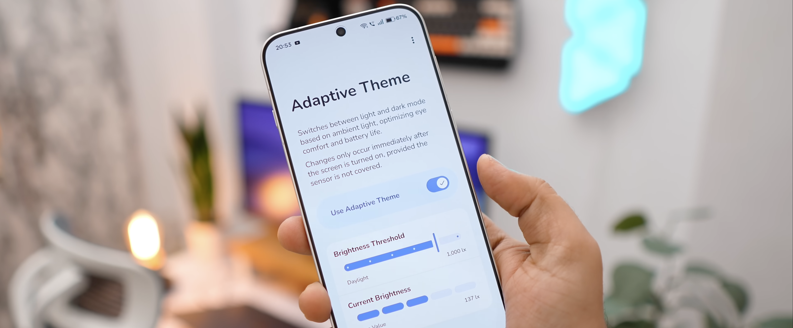

[](https://github.com/xLexip/Adaptive-Theme/releases/latest)
[](#)
<a href="https://play.google.com/store/apps/details?id=dev.lexip.hecate&referrer=utm_source%3Dgithub%26utm_medium%3Dreadme_button">
10k">
</a>
<a href="https://play.google.com/store/apps/details?id=dev.lexip.hecate">

[](https://play.google.com/store/apps/details?id=dev.lexip.hecate&referrer=utm_source%3Dgithub%26utm_medium%3Dreadme_banner)

# Adaptive Theme – Auto Dark Mode by Ambient Light

Adaptive Theme automatically switches between light and dark theme
using the ambient light sensor — not a fixed schedule.

It adapts to actual lighting conditions to optimize readability, eye comfort, and battery
life.


<a href="https://play.google.com/store/apps/details?id=dev.lexip.hecate&referrer=utm_source%3Dgithub%26utm_medium%3Dreadme_button">
    
</a>
‎ ‎ ‎
<a href="https://github.com/xLexip/Adaptive-Theme/releases">
    
</a> 
‎ ‎ ‎
<a href="https://play.google.com/store/apps/details?id=moe.shizuku.privileged.api&referrer=utm_source%3Dgithub_xlexip">
    
</a>

## Quick Start (2 minutes)

1. **Install** Adaptive Theme.
2. **Grant the permission** with the [web-tool](https://lexip.dev/setup), Shizuku, or other methods.
3. **Pick your lux threshold** and you’re done.

## Media Coverage

> **Android Authority** – **[This app gives Android the automatic
dark mode feature it desperately needs](https://www.androidauthority.com/automatic-dark-mode-android-adaptive-theme-3650081/)**

> **HowToMen (YouTube)** – **[Top 15 Best Android Apps, February 2026](https://www.youtube.com/watch?v=iY3FBMTA15A&t=98s&ref=GitHub_xLexip)**

> **Computer World** – **[The Android dark mode upgrade you deserve](https://www.computerworld.com/article/4154561/android-dark-mode-upgrade.html)**

## Features & Highlights

* **Smart Detection:** Uses your devices physical light sensor to switch the system
  theme.
* **Custom brightness threshold:** Choose exactly when the theme should flip or use a preset (
  indoor, outdoor, sunlight, etc.).
* **Stay dark at night:** Optionally keep dark mode active during a custom fixed time window (for
  example, 9 PM to 6 AM).
* **Battery Friendly:** The app is passive. Its event-driven architecture only checks the sensor
  when you turn on the screen — zero battery drain in the background.
* **No Root Required:** Root access is not required (but supported as an alternative setup
  method).
* **Shizuku Support:** One of multiple setup options is
  using [Shizuku](https://play.google.com/store/apps/details?id=moe.shizuku.privileged.api&referrer=utm_source%3Dgithub_xlexip).
* **Modern & Native:** Built with best-practices using Kotlin, Jetpack Compose and Material You
  for a smooth and solid experience.
* **50+ Languages:** Applied globalization at its best.
* **Transparent:** Free, open-source, no-ads.

## One-Time Setup

Android restricts apps from changing system themes by default. To unlock this feature, the
permission (`WRITE_SECURE_SETTINGS`) has to be granted.

The app comes with an easy step-by-step setup process, that lets you choose one of the following
methods to do so:

* **Web Tool (Recommended)** – A browser-based setup tool on a secondary device (Computer,
  Tablet,
  or Phone). No code or ADB
  installation required (WebADB).
  👉 **[lexip.dev/setup](https://lexip.dev/setup)**

* **Shizuku** – If you have [Shizuku](https://play.google.com/store/apps/details?id=moe.shizuku.privileged.api&referrer=utm_source%3Dgithub_xlexip)
  installed and configured, you can grant the permission directly within Adaptive Theme.

* **Root** – If your device is rooted, you can grant the permission directly in Adaptive Theme as
  well.

* **Manual ADB** – If you have ADB installed on your computer, you can simply run the ADB command
  manually:
  ```adb shell pm grant dev.lexip.hecate android.permission.WRITE_SECURE_SETTINGS```

## Safety

The required permission only allows the app to change system settings such as the dark mode. This is
absolutely safe and
completely reversible by uninstalling the app. It does **not** grant root access or read any user
data.

## How it works

**Wondering why the theme didn't change immediately?**

To avoid screen flicker and unnecessary background work, Adaptive Theme follows strict rules:

- **Event-driven:** It checks the light sensor only right after the screen turns on. Combined with
  hysteresis, this prevents flicker, avoids interruptions while you’re using the phone, and saves
  battery.
- **Validity check:** It verifies that the sensor is not obstructed (e.g. by a hand or pocket).
- **Seamless switch:** It switches the theme instantly, ensuring the UI is ready before you start
  interacting with it.

## FAQ

**Does this require root?**

* No. It works on stock devices. However, if you have Root, it can be used as an alternative setup
  method.

**What is the minimum Android version required?**

* The app works on Android 14 and above.

**Does it work with custom Android skins (Xiaomi MIUI, Samsung OneUI, etc.)?**

* In most cases, yes. It works with any system that respects the native Android Dark Mode
  implementation.

**My theme doesn’t change — what should I check?**

* Keep in mind that the theme only switched immediately after the screen is turned on, to optimize
  sensor usage and to not interrupt
  your device usage.
* Check that your sensor isn’t covered when you turn the screen on.
* Adjust your lux threshold and test in clearly bright/dim conditions.
* Check if the current lux value is shown correctly in the Adaptive Theme app.

**Does Adaptive Theme work on tablets?**

* No. Due to a technical detail, Adaptive Theme only works on smartphones.

## Support & Feedback

If Adaptive Theme doesn’t work for you — or if you have any questions or ideas — please [open an
issue](https://github.com/xLexip/Adaptive-Theme/issues/new) here or send feedback via the app.

## Support the Project

Adaptive Theme is **completely free**, **ad-free**, **open source**, and developed in my free time.

If you enjoy using the app, there are simple ways you can support the project:

⭐ **Star on GitHub:** Give this repository a star to help others find it.

🌟 **Rate on Google Play:**
A [5-star rating](https://play.google.com/store/apps/details?id=dev.lexip.hecate)
is the best way to boost the ranking.

☕ **Buy me a Coffee:** If you are feeling generous, you can
also [buy me a coffee](https://buymeacoffee.com/lexip).

📣 **Spread the Word:** Share the app to help the project grow.

## Architecture & Tech Stack

[](https://developer.android.com/)
[](https://kotlinlang.org/)
[](https://developer.android.com/compose)
[](https://source.android.com/docs/core/display/material)
[](https://gradle.org/)
[](https://sonarcloud.io/)

Adaptive Theme is built with modern Android engineering standards to ensure a lightweight,
maintainable, and production-ready codebase.

**Modern Codebase:** Written entirely in Kotlin with Jetpack Compose and Material 3 (Material You),
including haptic feedback.

**Architecture:** Follows the MVVM pattern with a Single-Activity architecture.

**Reactive Data:** ViewModels expose data via Kotlin Flows and manage concurrency with Coroutines.

**Persistence:** Type-safe settings storage with Jetpack DataStore.

**Background Work:** Sensor operations run event-driven – only upon screen-on
broadcasts – ensuring zero unnecessary battery drain in the background.

## Credits

* Thanks to Android Authority for their article:
  [**This app gives Android the automatic dark mode
  feature it desperately needs**](https://www.androidauthority.com/automatic-dark-mode-android-adaptive-theme-3650081/)
* Thanks to Computer World for their article:
  [**The Android dark mode upgrade you deserve**](https://www.computerworld.com/article/4154561/android-dark-mode-upgrade.html)
* Thanks to the following YouTubers for featuring Adaptive Theme:
    * HowToMen – [**Top 15 Best Android Apps - February 2026**](https://www.youtube.com/watch?v=iY3FBMTA15A&t=98s)
    * Mr. Android FHD – [**8 Incredible Apps That Every Android User Needs in 2026**](https://www.youtube.com/watch?v=CH_4E1LzGcU&t=459s)
    * El Androide Feliz – [**15 nuevas apps para Shizuku que son bestiales**](https://www.youtube.com/watch?v=eMznsQhldEw&t=152s)
    * TechTab – [**Top 10 Android Apps you need to try - March 2026**](https://www.youtube.com/watch?v=nSFYlenb_-U&t=298s)
    * Gadget Geek – [**Top 10 Best Android Apps | March 2026**](https://www.youtube.com/watch?v=8zQmriP8wSg&t=306s)
    * Tech Tricks – [**10 Best New Top Rated Android Apps | You Can't Miss**](https://www.youtube.com/watch?v=Ti4Pt6hNZzc&t=257s)
    * Всё про Андроид – [**Светлая и тёмная тема по датчику освещённости**](https://www.youtube.com/watch?v=Oj-WHpc5vK8)
* Thanks to [AlbertCaro](https://github.com/xLexip/Adaptive-Theme/pull/107) for Spanish translation
  strings.
* Font Credits: [Nunito](https://github.com/googlefonts/nunito), SIL Open Font License, Version 1.1, Copyright 2014 The Nunito Project Authors.

### **Made with 🥨 in Germany.**